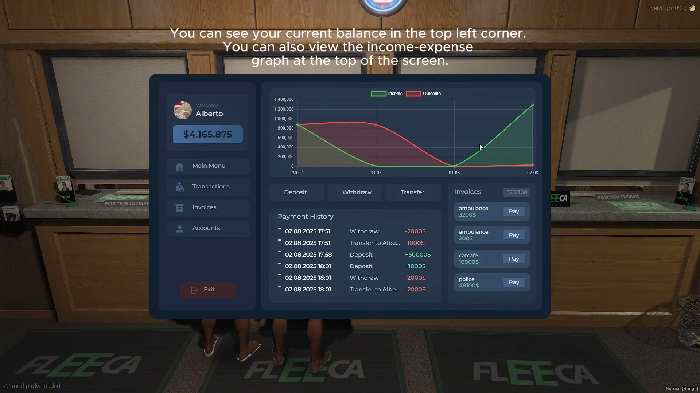
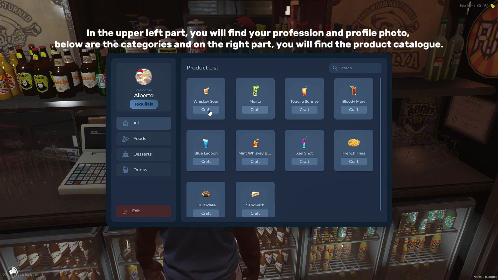
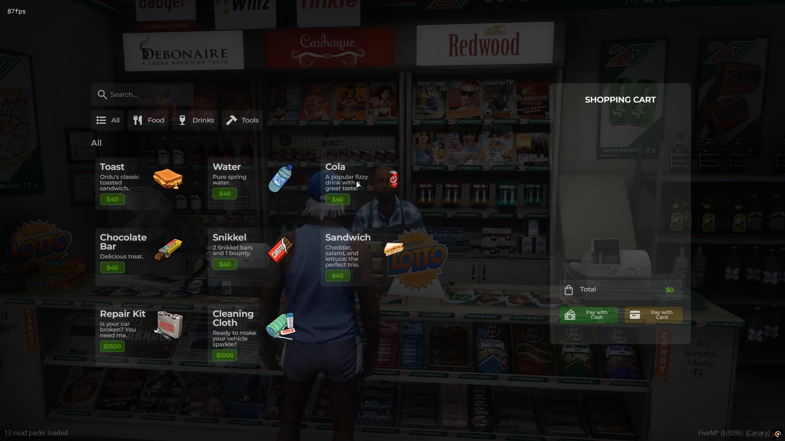

# 🖥️ FiveM UI

This repository showcases my custom user interface designs for FiveM. Each project followed a professional workflow: designed in **Figma** for high-fidelity visuals and then developed into a functional **NUI**.

## 🛠️ Tools Used
* **Design:** Figma (UI/UX)
* **Development:** HTML5, CSS3, JavaScript (ES6+)

---

## 🏦 Banking System
> A minimalist financial dashboard featuring real-time income/expense graphs and transaction management.

  
[Watch Preview](https://www.youtube.com/watch?v=HXkipunZMjA)

---

## 🍴 Restaurant System
> A professional business interface for managing staff tasks and crafting items via a clean catalog.

  
[Watch Preview](https://www.youtube.com/watch?v=J7T5VCot_l8)

---

## 🏎️ Vehicle Shop
> An aesthetic dealership UI that displays vehicle performance metrics and technical specifications.

  
[Watch Preview](https://www.youtube.com/watch?v=6e6tL8BkwK8)

---

## 🛒 Advanced Shop
> A fast and responsive supermarket interface with a dynamic shopping cart and checkout system.

  
[Watch Preview](https://www.youtube.com/watch?v=SKq8qEj3Vvo)

---

## 🔧 Advanced Garage
> A compact management panel to track vehicle status, including engine health and fuel levels.

  
[Watch Preview](https://www.youtube.com/watch?v=Pe_1f8mOkQs)
